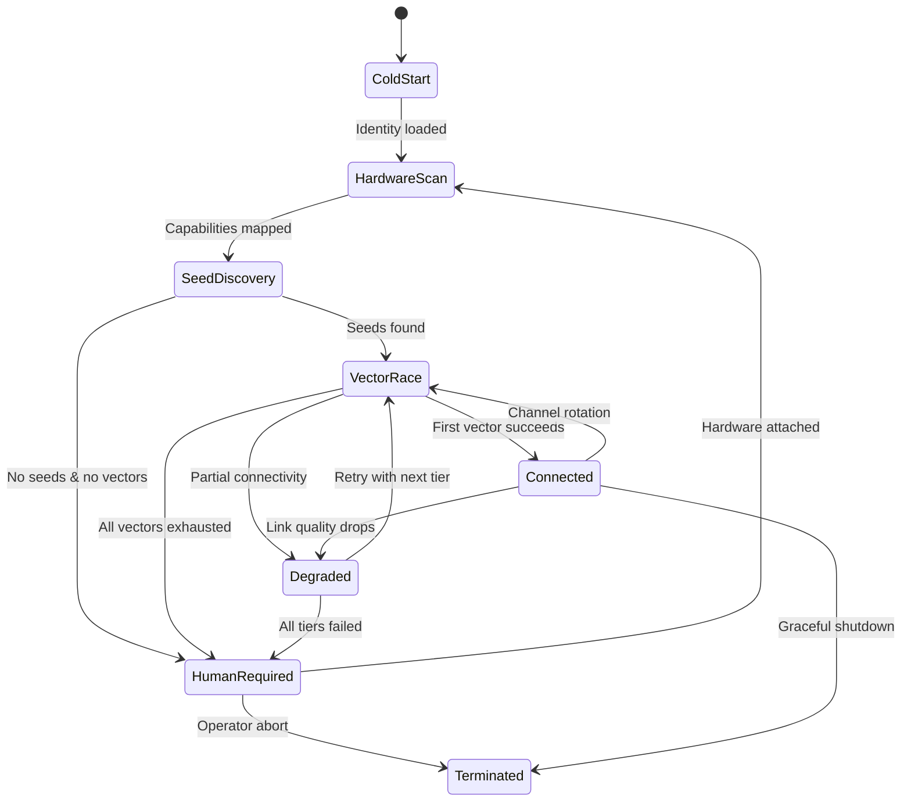

# Project Aether — Implementation Plan

## Обзор

**Project Aether** — автономный самовосстанавливающийся демон, обеспечивающий сетевую связность в условиях тотальной блокировки (Blackout / DPI / Whitelists). Архитектура построена как **конечный автомат (FSM)** с параллельным перебором векторов подключения (**Aggressive Happy Eyeballs**).

### Стек технологий

| Компонент | Язык | Обоснование |
|---|---|---|
| Core Orchestrator, PoW Validator, CLI | **Go** | Высокоуровневая конкурентность, goroutines для Happy Eyeballs |
| eBPF/XDP Kernel Stealth | **Rust** (Aya framework) | Безопасная работа с ядром, CO-RE, zero-panic guarantees |
| Generative Obfuscation ML | **Rust** (burn/candle) | Минимальный runtime, детерминизм, интеграция с сетевым стеком |
| Ultrasonic/Audio codecs | **C** | Прямой доступ к аудио-буферам, минимальная латентность |

---

## Proposed Changes

### Структура директорий проекта

```
aether/
├── cmd/
│   └── aetherd/                    # Точка входа демона
│       └── main.go
├── internal/
│   ├── orchestrator/               # Core Orchestrator (FSM + Happy Eyeballs)
│   │   ├── orchestrator.go         # Главный конечный автомат
│   │   ├── state.go                # Определения состояний
│   │   ├── vector.go               # Интерфейс вектора подключения
│   │   └── happy_eyeballs.go       # Параллельный перебор векторов
│   ├── cli/                        # CLI для запроса физического вмешательства
│   │   ├── operator.go             # Human Operator Interface
│   │   └── prompts.go              # Шаблоны запросов
│   ├── pow/                        # Tier 2: Proof-of-Work (Argon2id)
│   │   ├── challenge.go            # Генерация challenge
│   │   ├── solver.go               # Решение PoW
│   │   └── validator.go            # Верификация PoW
│   ├── oracle/                     # Tier 2: Decentralized Oracles
│   │   ├── doh.go                  # DNS-over-HTTPS resolver
│   │   ├── dot.go                  # DNS-over-TLS resolver
│   │   ├── fronting.go             # Domain Fronting
│   │   └── blockchain.go           # Чтение смарт-контрактов
│   ├── vectors/                    # Все векторы подключения (Tier 0-4)
│   │   ├── icmp_tunnel.go          # Tier 0: ICMP seed discovery
│   │   ├── at_modem.go             # Tier 0: AT-команды / SMS туннель
│   │   ├── obfuscated_tls.go       # Tier 1: ECH + HTTP/3 маскировка
│   │   ├── llm_mimicry.go          # Tier 1: Маскировка под API LLM
│   │   ├── webrtc_cover.go         # Tier 1: WebRTC cover traffic
│   │   ├── awdl.go                 # Tier 3: Apple AWDL P2P
│   │   ├── wifi_aware.go           # Tier 3: Android Wi-Fi Aware
│   │   ├── ble_mesh.go             # Tier 3: BLE Mesh
│   │   ├── dtn.go                  # Tier 3: Delay-Tolerant Networking
│   │   ├── lora.go                 # Tier 4: LoRa/Meshtastic Serial
│   │   ├── sdr.go                  # Tier 4: SDR трансивер
│   │   └── softmodem.go            # Tier 4: Softmodem (аналоговая линия)
│   ├── crypto/                     # Криптографические примитивы
│   │   ├── identity.go             # Ed25519 ключи узла
│   │   ├── noise.go                # Noise Protocol Framework
│   │   └── envelope.go             # Шифрование пакетов
│   └── hwscan/                     # Сканирование оборудования
│       ├── scanner.go              # COM/USB/Audio device enumeration
│       └── capabilities.go         # Hardware capability matrix
├── ebpf/                           # Rust: eBPF/XDP программы (Tier 0)
│   ├── Cargo.toml
│   ├── aether-ebpf/               # Kernel-space eBPF programs
│   │   ├── Cargo.toml
│   │   └── src/
│   │       ├── main.rs             # XDP packet interceptor
│   │       └── stealth.rs          # Traffic stealth transforms
│   └── aether-ebpf-common/        # Shared types kernel ↔ userspace
│       ├── Cargo.toml
│       └── src/
│           └── lib.rs
├── ml/                             # Rust: Generative Obfuscation ML (Tier 1)
│   ├── Cargo.toml
│   └── src/
│       ├── lib.rs
│       ├── model.rs                # Lightweight traffic shaper model
│       ├── entropy.rs              # Entropy controller
│       └── timing.rs               # Timing profile generator
├── ultrasonic/                     # C: Ultrasonic codec (Tier 3)
│   ├── Makefile
│   ├── codec.h
│   ├── codec.c                     # FSK modulation/demodulation 18-20 kHz
│   └── ffi.go                      # CGo bridge
├── configs/
│   └── aether.toml                 # Дефолтная конфигурация
├── go.mod
├── go.sum
└── README.md
```

---

### Компонент 1: Core Orchestrator (Go)

Ядро системы — конечный автомат, управляющий жизненным циклом демона.

#### [NEW] [state.go](file:///c:/Users/zxcno/aether/internal/orchestrator/state.go)

Определение всех состояний FSM:

```
ColdStart → HardwareScan → SeedDiscovery → VectorRace → Connected → Degraded → HumanRequired → Terminated
```

Каждое состояние имеет:
- `OnEnter()` — инициализация при входе
- `OnExit()` — cleanup при выходе
- `Evaluate()` → следующее состояние
- `Timeout` — максимальное время пребывания

#### [NEW] [orchestrator.go](file:///c:/Users/zxcno/aether/internal/orchestrator/orchestrator.go)

Главный цикл FSM:
1. **ColdStart**: Загрузка конфигурации, генерация/восстановление Ed25519 идентификатора
2. **HardwareScan**: Параллельный опрос COM/USB/Audio/Network interfaces через `hwscan`
3. **SeedDiscovery**: Извлечение seed-узлов через AT-команды, ICMP, DNS TXT, Domain Fronting, блокчейн
4. **VectorRace**: Aggressive Happy Eyeballs — запуск ВСЕХ доступных векторов параллельно, использование первого успешного
5. **Connected**: Рабочий режим, фоновый мониторинг и ротация каналов
6. **Degraded**: Частичная потеря связности, эскалация по tier'ам
7. **HumanRequired**: Все программные векторы исчерпаны, CLI-запрос к оператору
8. **Terminated**: Graceful shutdown

#### [NEW] [happy_eyeballs.go](file:///c:/Users/zxcno/aether/internal/orchestrator/happy_eyeballs.go)

Реализация Aggressive Happy Eyeballs:
- Каждый вектор подключения запускается как goroutine
- Используется `context.Context` с каскадными таймаутами (Tier 0: 5s, Tier 1: 15s, Tier 2: 30s, ...)
- Первый успешный вектор побеждает через `select` + channel
- Неуспешные goroutines gracefully завершаются через cancel

#### [NEW] [vector.go](file:///c:/Users/zxcno/aether/internal/orchestrator/vector.go)

Интерфейс, который реализуют все вектора:

```go
type Vector interface {
    Name() string
    Tier() int
    RequiresHardware() []HardwareType
    Probe(ctx context.Context) (*Connection, error)
    Maintain(ctx context.Context, conn *Connection) error
    Priority() int
}
```

---

### Компонент 2: Proof-of-Work Validator (Go) — Tier 2

#### [NEW] [challenge.go](file:///c:/Users/zxcno/aether/internal/pow/challenge.go)

Генерация PoW challenge:
- `nonce` (32 bytes random)
- `difficulty` — адаптивная сложность (target leading zero bits)
- `timestamp` — для TTL (challenge протухает через 60s)
- `node_pubkey` — Ed25519 public key запрашивающего

Формат: `HMAC-SHA256(nonce || difficulty || timestamp || node_pubkey)`

#### [NEW] [solver.go](file:///c:/Users/zxcno/aether/internal/pow/solver.go)

Решение challenge с использованием Argon2id:
- Параметры: `time=3, memory=64MB, threads=4, keyLen=32`
- Итеративный подбор `solution_nonce` пока `Argon2id(challenge || solution_nonce)` не даст хеш с `difficulty` ведущих нулевых битов
- Memory-hard функция делает GPU/ASIC атаки экономически невыгодными
- Решение занимает ~2-5 секунд на легитимном узле

#### [NEW] [validator.go](file:///c:/Users/zxcno/aether/internal/pow/validator.go)

Верификация входящих proof:
1. Проверка `timestamp` — TTL не истёк
2. Проверка `node_pubkey` — не в бан-листе
3. Пересчёт `Argon2id(challenge || solution_nonce)` — O(1) верификация
4. Проверка difficulty — хеш удовлетворяет текущему порогу
5. Rate limiting — один node_pubkey не может решать > N challenges/min

---

### Компонент 3: Human Operator Interface (Go)

#### [NEW] [operator.go](file:///c:/Users/zxcno/aether/internal/cli/operator.go)

Механизм запроса физического вмешательства:

```go
type HumanAction struct {
    ID          string
    Priority    ActionPriority  // Critical, High, Normal
    Description string          // Человекочитаемое описание
    Hardware    HardwareType    // Тип оборудования
    Deadline    time.Duration   // Таймаут ожидания
    Callback    func() error    // Проверка выполнения
}
```

Сценарии запросов:
1. `ATTACH_LORA_ANTENNA` — "Подключите LoRa трансивер к USB-порту"
2. `ENABLE_HOTSPOT` — "Включите Wi-Fi точку доступа на телефоне"
3. `CONNECT_PHONE_LINE` — "Подключите телефонный кабель к модему"
4. `POSITION_SDR` — "Направьте SDR-антенну на азимут XXX°"

Поведение:
- Запрос выводится в stderr (чтобы не мешать pipe)
- Ожидание подтверждения через stdin или автоматическая проверка (USB hotplug events)
- При таймауте — эскалация или fallback на другой вектор

#### [NEW] [prompts.go](file:///c:/Users/zxcno/aether/internal/cli/prompts.go)

Локализованные шаблоны CLI-запросов (RU/EN), форматирование с ANSI-кодами для приоритетов.

---

### Компонент 4: eBPF/XDP Stealth Module (Rust)

#### [NEW] [main.rs](file:///c:/Users/zxcno/aether/ebpf/aether-ebpf/src/main.rs)

XDP-программа, перехватывающая пакеты на уровне NIC:
- Маркировка исходящих Aether-пакетов для обхода локальных мониторов
- Модификация TTL, TCP window size, IP ID field для fingerprint evasion
- Перезапись timing patterns на уровне TC (traffic control) hook

#### [NEW] [stealth.rs](file:///c:/Users/zxcno/aether/ebpf/aether-ebpf/src/stealth.rs)

Transform pipeline:
1. **TTL Normalization** — выставление TTL как у легитимного трафика ОС
2. **TCP Fingerprint Mimicry** — эмуляция TCP stack fingerprint (p0f evasion)
3. **Packet Coalescing** — склеивание мелких пакетов для снижения статистического шума
4. **Entropy Flattening** — XOR padding для нормализации энтропии payload

---

### Компонент 5: Generative Obfuscation ML (Rust) — Tier 1

#### [NEW] [model.rs](file:///c:/Users/zxcno/aether/ml/src/model.rs)

Легковесная модель (~5MB), реализованная на `burn` (Rust ML framework):
- **Input**: текущий профиль DPI (детектированные правила), целевой профиль трафика
- **Output**: параметры трансформации (padding size distribution, inter-packet delay, burst pattern)
- Архитектура: 3-layer MLP с ReLU, квантизированная до INT8
- Обучение offline, inference ~0.1ms на CPU

---

### Компонент 6: Hardware Scanner (Go)

#### [NEW] [scanner.go](file:///c:/Users/zxcno/aether/internal/hwscan/scanner.go)

Перечисление доступного оборудования:
- **COM/Serial**: Поиск AT-совместимых модемов (`/dev/ttyUSB*`, `COM*`)
- **USB**: Поиск LoRa трансиверов (VID/PID Meshtastic devices)
- **Audio**: Перечисление аудио-устройств для Ultrasonic/Softmodem
- **Network**: Wi-Fi interfaces с поддержкой monitor mode, BLE adapters
- **SDR**: Поиск RTL-SDR, HackRF через libusb

Результат: `HardwareCapabilityMatrix` — битовая маска доступного оборудования, используемая Orchestrator'ом для фильтрации доступных векторов.

---

## Диаграмма FSM



---

## User Review Required

> [!IMPORTANT]
> **Целевая ОС**: Архитектура спроектирована для Linux (eBPF/XDP требует ядро ≥ 5.15). Компоненты на Go (Orchestrator, PoW, CLI) кроссплатформенны, но eBPF и часть hardware-интеграций — Linux-only. Для Windows планируется fallback через WinDivert. Подтвердите целевую платформу.

> [!WARNING]
> **eBPF требует root/CAP_BPF**: Демон должен запускаться с повышенными привилегиями для загрузки eBPF-программ. Это необходимо для Tier 0. Вы согласны с этим требованием?

> [!IMPORTANT]
> **Объём первой итерации**: Полная реализация всех 5 тиров — это масштаб production-проекта на месяцы. Предлагаю для первой итерации реализовать:
> 1. Core Orchestrator (FSM + Happy Eyeballs) — полностью
> 2. PoW Validator (Argon2id) — полностью
> 3. Human Operator Interface — полностью
> 4. eBPF/XDP Stealth — каркас с TTL normalization
> 5. 2-3 базовых вектора (ICMP tunnel, DoH resolver, BLE mesh stub)
> 
> Остальные модули — как интерфейсы/stubs для последующей реализации. Согласны?

## Open Questions

> [!IMPORTANT]
> 1. **Протокол между узлами**: Использовать Noise Protocol Framework (как в WireGuard) или собственный протокол на базе X25519 + ChaCha20-Poly1305?
> 2. **Формат seed-узлов**: Какой формат bootstrap-информации? Предлагаю: `Ed25519_PubKey || IP:Port || Signature` (64 bytes compact).
> 3. **ML модель**: Включить предобученную модель в бинарник через `include_bytes!()` или загружать из файловой системы?
> 4. **Meshtastic vs raw LoRa**: Использовать Meshtastic Serial API (простота) или raw LoRa через SX126x драйвер (полный контроль)? Они несовместимы на уровне протокола.

## Verification Plan

### Automated Tests
```bash
# Unit tests для PoW validator
go test ./internal/pow/... -v -race

# Unit tests для Orchestrator FSM
go test ./internal/orchestrator/... -v -race

# Integration test: FSM state transitions
go test ./internal/orchestrator/ -run TestFullLifecycle -v

# eBPF compilation check (requires bpf-linker)
cd ebpf && cargo build --release --target bpf

# Benchmark PoW solver
go test ./internal/pow/ -bench=BenchmarkSolver -benchmem
```

### Manual Verification
- Запуск демона в изолированном network namespace для тестирования FSM transitions
- Проверка CLI prompts в интерактивном режиме
- Верификация PoW timing: решение должно занимать 2-5 секунд на среднем CPU
